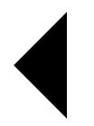
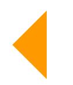
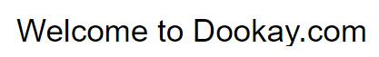
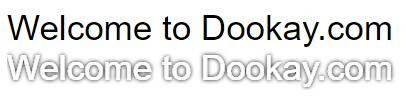

# SVG应用实践——如何在你的网站中使用酷酷的SVG（一）

  作为一种图形格式，SVG对于设计师来讲并不陌生，业内有很多成熟的工具可以设计并输出SVG，包括Adobe Illustrator、Visio以及CorelDRAW等。但是对于前端工程师来讲，SVG令人感到陌生，我们更倾向于使用位图格式的png，jpeg，就其缘由，我们的网站需求并不需要SVG的特性，之前的浏览器对SVG的支持并不好。  
  我们追溯SVG的历史，会发现它与我们的web发展有着莫大的渊源，SVG从1999年由一组加入W3C的公司启动开发，但是，之后的工作并没有得到良好的支持，直到2011年，发布的SVG1.1才成为W3C推荐的标准，其中有HTML5标准的推动以及Flash的衰落，而到现在为止，我们在网站开发实践中，发现了诸多SVG的特点为我们运用。  
  简单介绍下SVG的定义，可缩放矢量图形（Scalable Vector Graphics，SVG)，是一种用来描述二维矢量图形的XML 标记语言。  
  SVG与Flash类似，都是用于二维矢量图形，二者的区别在于，SVG是一个W3C标准，基于XML，是开放的，而Flash是封闭的基于二进制格式的。因为都是W3C标准，SVG与其他的W3C标准，比如CSS, DOM和SMIL等能够协同工作。  
  一个简单的SVG文档由\<svg\>根元素和基本的形状元素(圆形、矩形、简单或复杂的曲线，以及其他形状)构成。另外还有一个g元素，它用来把若干个基本形状编成一个组。

---

以上只是对SVG知识的一个简单介绍，下面我们来进行SVG实践，本文不涉及到绘制SVG图形，而是在我们拿到设计师的SVG文件之后，我们
能够做些什么？

我们先看一个标准的SVG文件

```html
  <svg viewBox="0 0 13 20" xmlns="http://www.w3.org/2000/svg">
      <polyline points="10,3 3,10 10,17"></polyline>
  </svg>
```

\<polyline\> 标签用来创建仅包含直线的形状，上面的文件看上去是这个样子的



黑色并不是我们想要的，我们让他变成橘红色

```svg
  <svg viewBox="0 0 13 20" xmlns="http://www.w3.org/2000/svg">
      <polyline points="10,3 3,10 10,17" fill="#ff9900"></polyline>
  </svg>
```

fill属性，可以改变图形的颜色 



我们需要有一个hover效果，因为之前说过SVG可以与CSS协作，所以我们可以在css中尝试

```css
  polyline{
    transition: fill .4s;
  }
   svg:hover polyline {
      fill: green;
    }
```

完美兼容css的transition属性，就不放动态图了，大家可以在代码中实践。
接下来我们进行SVG其他属性的探索，有时候，我们需要一个矢量化字体，比如

```html
<svg xmlns="http://www.w3.org/2000/svg" width="500" height="40" viewBox="0 0 500 40">
  <text x="0" y="35" font-family="Arial" font-size="35">
    Welcome to Dookay.com
  </text>
</svg>
```

  

啊，看上去很普通嘛，我们想办法给他加点酷酷的效果，我们知道CSS3有text-shadow属性，看上去很nice,
那么我们能给SVG也加个阴影吗。

```html
<svg xmlns="http://www.w3.org/2000/svg" width="500" height="40" viewBox="0 0 500 40">
   <defs>
        <filter id="a" x="1" y="1">
            <feOffset result="offOut" in="SourceAlpha"/>
            <feGaussianBlur result="blurOut" in="offOut" stdDeviation="1"/>
            <feColorMatrix result="matrixOut" in="offOut" values="0 0 0 0 0 1 1 1 1 0 0 0 0 0 0 0 0 0 1 0"/>
            <feBlend in="SourceGraphic" in2="blurOut"/>
        </filter>
  </defs>
  <text x="0" y="35" font-family="Arial" font-size="35" filter="url(#a)" fill="#fff">
    Welcome to Dookay.com
  </text>
</svg>
```

我们把文字填充成白色，然后给他添加个滤镜再看看  



对比一下，是不是一下有了E术的气息。

- \<defs\> 引用的元素容器
- \<filter\> 滤镜效果的容器
- \<feOffset\> SVG滤镜。相对其当前位置移动图像
- \<feGaussianBlur\> SVG滤镜。执行高斯模糊图像
- \<feColorMatrix\>  SVG滤镜。适用矩阵转换
- \<feBlend\> 使用不同的混合模式把两个对象合成在一起

通过上述属性我们可以为SVG添加丰富的滤镜效果。