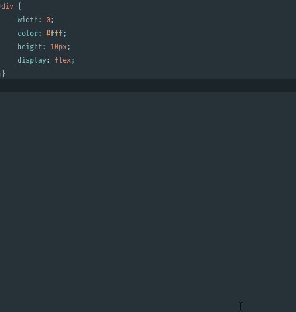
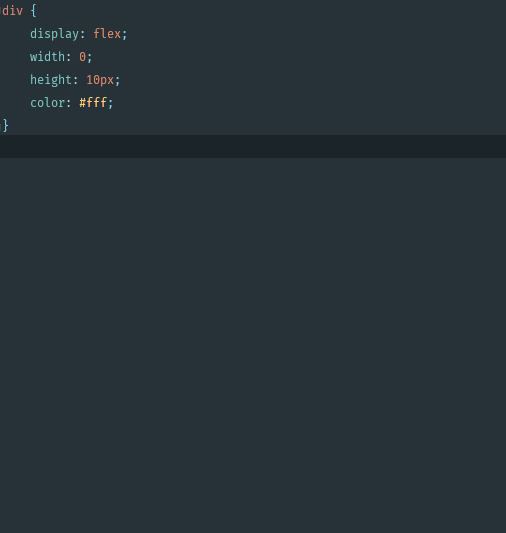
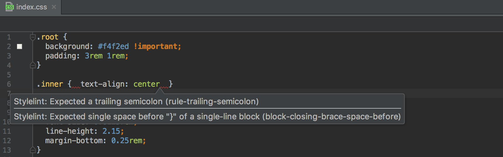
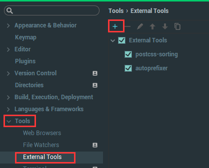
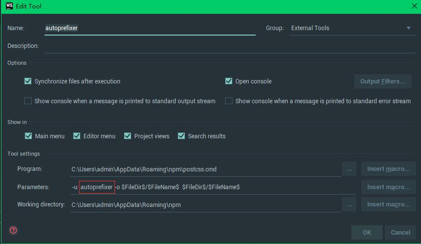
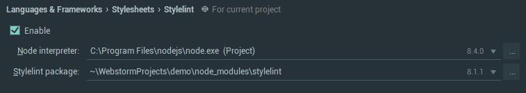

# css辅助功能

当前版本

- Webstorm(2017.02)
- Node.js(8.4.0)

## 1. 实现css自动排序

如下图：



## 2. 自动补全后缀

如下图:



## 3. css代码规范检测



## 功能实现

1. 安装依赖包

- `npm install postcss-cli -g`
- `npm install autoprefix -g`
- `npm install postcss-sorting -g`
- `npm install stylelint -g`

1. 在webstorm中配置`autoprefixer`和`postcss-sorting`功能

    - 打开设置界面

    

    - 添加配置选项(红框区域是你的插件名，Name属性可以随意命名)

    Program: `C:\Users\admin\AppData\Roaming\npm\postcss.cmd` (Postcss插件)

    Parameters: `-u  autoprefixer -o $FileDir$/$FileName$  $FileDir$/$FileName$`

    Working directory: `C:\Users\admin\AppData\Roaming\npm\` (Npm目录)

    

1. 在webstorm中配置`stylelint`功能  （2016.03版本开始拥有此功能）

    

    **stylelint package**指向stylelint的安装目录

    (*2016.03版Webstorm无法识别最新版本的stylelint，需要升级到2017或者对stylelint降级*)

    在项目目录中新建`.styleintrc`规则文件，官方推荐两种规则

    - [`stylelint-config-standard`](https://github.com/stylelint/stylelint-config-standard)
    - [`stylelint-config-recommended`](https://github.com/stylelint/stylelint-config-recommended)

    引入规则

    ```JSON
    {
        "extends": "stylelint-config-recommended"
    }
    ```
