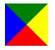

# CSS实例 —— 水平时间轴

之前拿到的一个设计稿，时间轴设计得很有意思。首先，他是长这个样子的（此处应有图片），采用水平方向设计，在垂直方向上节省了空间，并采用了多种配色，使之表现更加鲜明活泼等等，当然此处不再赘述设计上的理念，单从前端切图的角度来看，如何去实现其原本的设计，也就是还原设计稿。

## 1.开始位置

通过测量可知，时间轴中轴线在整个板块区间垂直居中，每一小块内容区上下错落分布，宽度则均为200px,左右没有间隙，内容的起始位置并没有在屏幕的最左边(对大屏幕而言),而是在其container的开始位置。

```css
.container{
  width:1200px;
  margin-left:auto;
  margin-right:auto;
}
```

这时候我们可能会想把内容写在container的里面

```html
<div id="wrapper">
    <div class="container">
        <div class="timeline-wrapper"></div> /*时间轴包裹容器*/
    </div>
</div>
 ```

 这样会带来另一个问题，内容会在超出container宽度以后换行，怎么解决这个问题呢，我们要让我们的*timeline-wrapper*从标准文档流中解放出来，不让它受到宽度的束缚，我们为其定义一个*position:absolute*的属性，当然，根据绝对定位（absolute）根据父级定位元素的初始位置进行定位的特性来讲，我们必须给予*container*一个定位属性也就是相对定位*position:relative* 否则，它只能基于祖先元素也就是文档的初始位置进行定位了，这样做虽然能够解决当前问题，但是，有没有优化的方式呢，我们能不能不依靠*container*直接让*timeline-wrapper*居中呢，好的，下面就是

### **TIP1：利用绝对定位实现元素在文档中的定位**

 ```css
 #wrapper{
   position:relative;
 }
 .timeline-wrapper{
   position:absolute;
   left:50%;
   margin-left:-600px;
 }
 ```

如果我们已知绝对定位元素的宽度，我们就可以将上面的代码稍作修改*margin-left:width/2*来实现元素的水平居中

## 2.年份圆形的位置

现在开始划分内容，这里我把每一年份划分成一块，即**timeline-item**，每一块中我又把年份分成一块**heading**,内容分成另一块**body**,所以现在看起来是这样的。

```html
<div id="wrapper">
  <div class="timeline-wrapper">
    <section class="timeline-item">
      <div class="heading">2016</div>
      <div class="body">2016年发生了...</div>
    </section>
  </div>
</div>
```

这里年份在垂直方向上居中，然后每一块内容区的高度并不一致，所以我们给**.body**设置一个**absolute**,再给**timeline-item**一个**relative**属性，这样**timeline-item**的高度就等于**.heading**的高度，根据tip1，这里有

```css
.timeline-item{
  position:relative;
  top:50%;
  margin-top:???; /*-(heading高度/2)*/
}
```

这里**heading**高度我们固然可以测出来，但是万一有改动呢，我们每次都要修改**margin-top**值吗，不尽然，我们可以利用css3的transform属性

### **TIP2：利用transform实现垂直居中**

```css
.timeline-item{
  position:relative;
  top:50%;
  transform:translateY(-50%);
}
```

由于transform百分比计算的是元素本身，我们并不需要知道元素自身的尺寸，**transform:translate(-50%,-50%)**通常配合定位实现未知尺寸元素的水平垂直居中。

## 3.内容区域的错落排序

我们看到，时间轴排序均是一上一下进行排序的，很久之前看过的一本书《javascript DOM 编程艺术》里面有提到过利用javascript控制DOM的奇偶顺序，不过现在，我们已经可以利用css3来实现这件事了。

### **tip3 利用CSS3新属性实现奇偶排序**

```css

.timeline-item {
  .body {
    /*这里定义内容样式*/
  }
  &:nth-of-type(even) {
    .body {
       /*这里定义内容样式*/
    }
  }
}

```

关于*nth-of-type*的定义,:nth-of-type属于CSS伪类，匹配一个在文档树中位置为an+b-1 且和伪元素前名字一样的元素，详细文档可以参考[MDN](https://developer.mozilla.org/zh-CN/docs/Web/CSS/:nth-of-type)

## 4.来为内容区做点小修饰

1. 为内容区添加修饰的小三角形箭头
2. 为内容区添加一个hover效果

关于三角形箭头的生成，我们有两种方案可以选择，一种是利用css3中transform属性中的rotate将一个矩形旋转生成，另一种
方式就是依赖border生成，这里我们选择常用的border生成三角形。

### **tip4 纯css绘制三角**

```css
div{
    width:0;
    height:0;
    border-style:solid;
    border-width:30px 30px 30px 30px;
    border-color: green yellow red blue;
}
```

上面的CSS代码描述了其中原理，如图所示



内容区的hover效果可以随意，这里笔者添加了阴影和位移效果

```css
.timeline-item{
   transition: transform .2s;
}
 .timeline-item:hover {
      box-shadow: 2px 2px 6px #d0d0d0;
      transform: translateY(4px);
    }

```

## 5.实现标题的不同颜色

以往我们实现标题的不同颜色，可能会对每一个元素单独加一个类名，或者利用juqery循环dom元素实现，这里我们可以使用
**:nth-child(n)**来表现，**:nth-child**的用法与**:nth-of-type**类似，可以参阅[MDN](https://developer.mozilla.org/zh-CN/docs/Web/CSS/:nth-child
),但是我们看到这里年份足足有八个（很平衡？误。。。），如果像下面这样，就很累，很难受。

```css
nth-child(1){
  border-color: color
}
nth-child(2){
  border-color: color
}
nth-child(3){
  border-color: color
}
.................
.............
..........
nth-child(n){
  border-color: color
}
```

为了提高开发效率，弥补原生css中的遗憾，我们可以使用sass预编译器，让我们以编程语言的方式来写CSS

### **tip5 scss  函数运用**

```scss

$colorList: #e21e1f #f55fab #db34c7 #a957df #7479d3 #3589ca #36bdc9 #40c092;
@each $color in $colorList {
  $i: index($colorList, $color);
  .timeline-item:nth-child(#{$i}) {
    > .heading {
      border-color: $color;
      color: $color;
    }
  }
}

```

上面代码中，我们定义scss变量$colorList,这里我们可以认为它是一个数组，然后我们使用@each循环$colorList在循环里面，我们通过定义$i获取循环中的索引，这里用到了index(array,item)函数，它返回的是item在array中的位置，但是与编程语言不同的是，这个$i是从1开始的,这一点是和nth-child一致的，编译出来：

```css

.timeline-item:nth-child(1) > .heading {
  border-color: #e21e1f;
  color: #e21e1f; }

.timeline-item:nth-child(2) > .heading {
  border-color: #f55fab;
  color: #f55fab; }

.timeline-item:nth-child(3) > .heading {
  border-color: #db34c7;
  color: #db34c7; }

.timeline-item:nth-child(4) > .heading {
  border-color: #a957df;
  color: #a957df; }

.timeline-item:nth-child(5) > .heading {
  border-color: #7479d3;
  color: #7479d3; }

.timeline-item:nth-child(6) > .heading {
  border-color: #3589ca;
  color: #3589ca; }

.timeline-item:nth-child(7) > .heading {
  border-color: #36bdc9;
  color: #36bdc9; }

  .timeline-item:nth-child(8) > .heading {
  border-color: #40c092;
  color: #40c092; }

```

至此，我们时间轴的制作也就差不多了，中间的线我们用渐变来表示，其他小样式调整就不描述了，
大家可以戳[Demo](https://jsfiddle.net/kwha27ga/)
