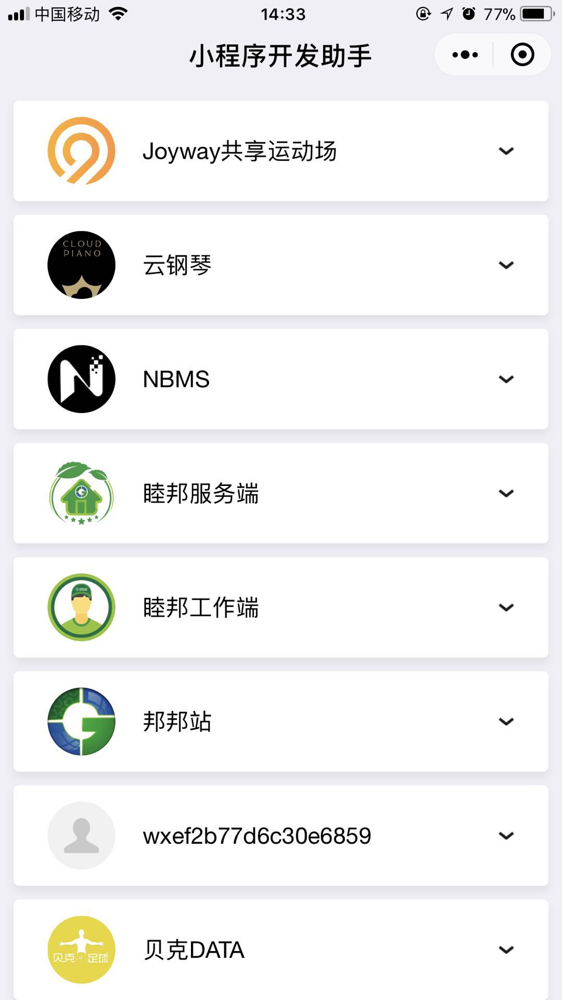

# 个人简历

## 联系方式

- Email：dbzbook@163.com

- QQ： 2546934205

---

## 基本信息

- Gloye / 男

- 专科/计算机网络技术

- 工作年限：3年

- 籍贯：河北 邢台

- 期望职位：Web前端工程师

- 期望城市：上海

---

## 工作经历

### [上海稻壳网络科技有限公司](http://www.dookay.com) （ 2015年4月 ~ 至今 ）

---

## 项目经验

### **集团企业公司网站项目建设**（2015 ~ 2016）

业务主体是官网，业务职能是进行品牌展示，产品推介，品牌文化传播

负责前台页面开发，兼顾后台PHP模板整合

优化了开发流程，参与了技术栈的迭代，实现了开发效率的提升

在技术实践上：

- 利用自动化工具(gulp)实现一套自己的工作流

- 使用预编译语言简化开发过程 (pug代替html，scss代替scss)

#### 上线网站

- [康乃馨布草](http://www.canasin.com/)

- [亚细亚瓷砖](http://www.asatiles.com)

### **小程序开发** （ 2017 ~ 2018 ）

以上为项目列表，基于小程序原生组件以及类Vue语法小程序框架Wepy开发，70%-80%的小程序功能都接触过，经验较为丰富

> Joyway小程序简述

- 业务难点

  - 业务核心是扫码支付共享体育场，扩展模块是针对核心的周边服务

  - 这个一个拥有100+页面的复杂应用

  - 业务需求在开发过程中是不断讨论和变更的

  - 小程序本身存在的一些缺陷

- 业务实现

  - 在程序开发过程中使用了wepy框架，[点击了解](https://tencent.github.io/wepy/)

  - 拆分了原有页面，进行页面组件化，实现页面复用，使开发页面减少到70+

  - 进行业务需求的最小颗粒化实现，高内聚，低耦合，有效应对业务逻辑变更的重构成本

  - 积极沟通，前后端协作处理小程序与web页面的差异性

- 不足与改进

  - 缺乏状态管理工具，页面data(state)组织比较混乱

---

## 个人总结

现公司唯一指定小程序开发工程师

写了两年网页(俗称DIV+CSS)

前CCNA认证网络工程师

有过博客，[地址](https://github.com/gloye/gl-first/tree/master/my_note)

目前在~~Writing~~Learning一个基于React的个人项目

会修电脑的程序员

信仰2玩家

Arsenal球迷

总管的书迷

老实人

---

## 我的期望

以下可以匹配一项或多项_(:з」∠)_

- 做有趣的事

- 团队关系融洽

- 工作环境轻松

- 不错的薪资

### **以上 谢谢阅读**